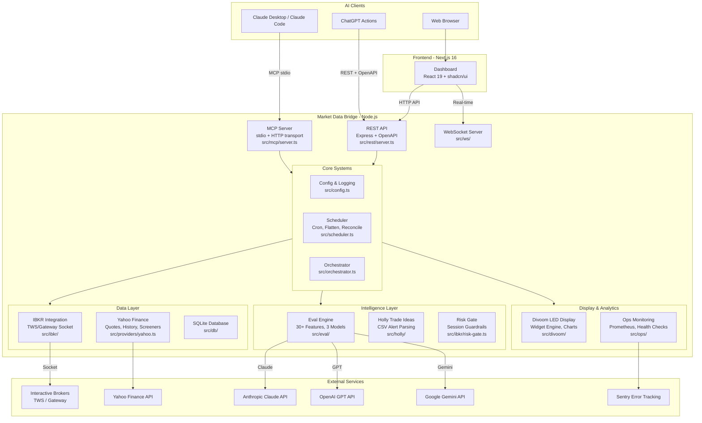
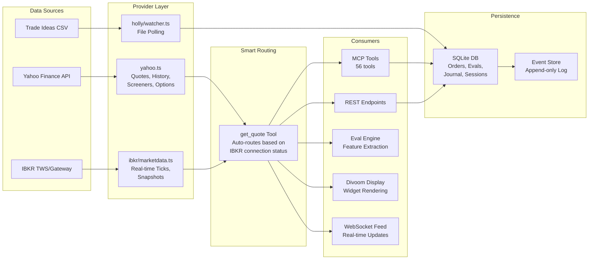
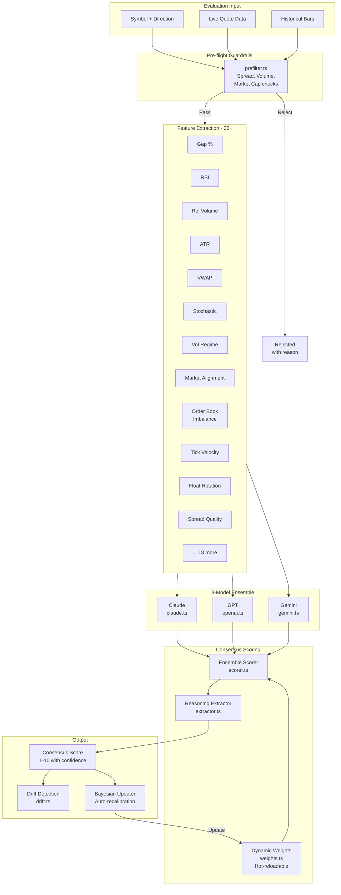
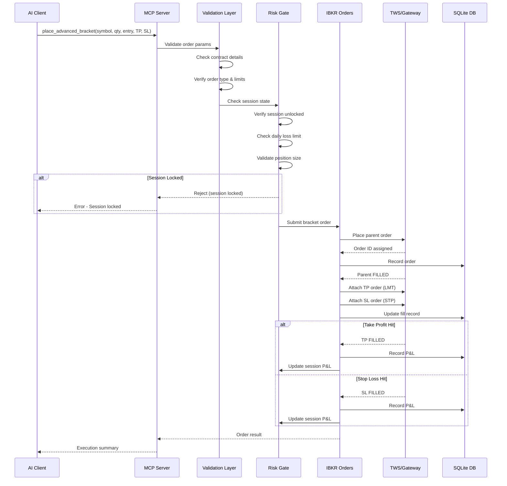

# Architecture Overview

Market Data Bridge connects AI assistants to financial markets through a modular TypeScript backend with 20+ subsystems.

## System Architecture

The high-level system diagram shows how AI clients connect through MCP and REST interfaces to the core backend, which integrates with external market data and AI model providers.

## Data Flow

Market data flows from Yahoo Finance and Interactive Brokers through a smart routing layer that selects the best available source, then fans out to consumers including MCP tools, the REST API, the eval engine, and the Divoom display.

## Eval Engine

The 3-model ensemble evaluation engine extracts 30+ technical features, sends them to Claude, GPT, and Gemini for scoring, then produces a weighted consensus with drift detection and Bayesian auto-recalibration.

## Order Execution

Orders flow through validation and risk gate checks before reaching IBKR TWS. The `place_advanced_bracket` tool handles the full lifecycle including parent fill, take-profit/stop-loss attachment, and session P&L tracking.

## Key Modules

| Module | Path | Responsibility |
|--------|------|----------------|
| MCP Server | `src/mcp/server.ts` | 56 tools for Claude Desktop/Code |
| REST API | `src/rest/server.ts` | Express + OpenAPI for ChatGPT |
| IBKR | `src/ibkr/` | TWS connection, orders, market data |
| Yahoo | `src/providers/yahoo.ts` | Quotes, screeners, fundamentals |
| Eval Engine | `src/eval/` | 3-model ensemble with 30+ features |
| Database | `src/db/` | SQLite persistence layer |
| Divoom | `src/divoom/` | LED display widget engine |
| Holly | `src/holly/` | Trade Ideas automation |
| Scheduler | `src/scheduler.ts` | Cron jobs, EOD flatten |
| Ops | `src/ops/` | Prometheus, health checks |
